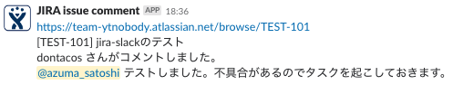

# jira-slack.js

Web entrypoint application that notifies to Slack when who wrote a new comment into an issue upon JIRA.

## SYNOPSIS

    git clone https://github.com/ytnobody/jira-slack.git
    cd jira-slack
    npm install
    PORT=5000 \
    JIRA_TEAM=myteamname \
    SLACK_WEBHOOK_URL=https://hooks.slack.com/... \
    SLACK_CHANNEL="#jira-comments" \
    npm start

## ENV

### JIRA_TEAM [required]

sub-domain of your JIRA team 

    https://[here].atlassian.net/
### SLACK_WEBHOOK_URL [required]

Slack webhook url that your own

### SLACK_CHANNEL [default=#random]

Destination channel for posting messages
### PORT [default=3400]

Port for waiting requests

## SEE ALSO

* [JIRA と Slack は連携できますか？ - Atlassian コミュニティ ](https://www.ricksoft.jp/qa/questions/8520384/jira-%E3%81%A8-slack-%E3%81%AF%E9%80%A3%E6%90%BA%E3%81%A7%E3%81%8D%E3%81%BE%E3%81%99%E3%81%8B)
